# Implementation Plan - gRFC A85: ORCA Metrics Propagation to LRS

This document outlines the design and sequential tasks for implementing gRFC A85 in the `grpc-java` repository. gRFC A85 enables the propagation of Out-of-Band (OOB) and Per-Query backend metrics (reported via Open Request Cost Aggregation - ORCA) into the Load Reporting Service (LRS) load reports.

---

## 1. Overview & Goal

The goal is to allow `grpc-java` load reporting clients to collect ORCA utilization metrics (CPU, memory, application utilization, and custom named metrics) from backends, aggregate them per-locality, and report them to the LRS server.

### Key Requirements
1. **CDS Parsing & Propagation Config**: Parse the `lrs_report_endpoint_metrics` field in the CDS Cluster proto.
2. **Feature Flag**: Guard parsing and metric collection with environment variable `GRPC_EXPERIMENTAL_XDS_ORCA_LRS_PROPAGATION` (defaults to true).
3. **Dedicated Metric Tracking**: Track standard utilization metrics (CPU, Memory, Application) separate from custom named metrics.
4. **Locality Keying**: Key locality stats handles by both `Locality` and `BackendMetricPropagation` configuration to handle dynamic configuration changes.
5. **Metric Validation**: Validate recorded metrics (e.g., non-negative, finite, memory $\le 1.0$).
6. **Custom Named Metrics Prefixing**: Prefix custom named metrics with `"named_metrics."` before reporting.
7. **Dynamic Stats Handle Swapping**: Safely update stats handles for pickers and active subchannels when the propagation config changes without recreating subchannels or dropping in-flight statistics.
8. **Thread Safety & Lock Protection**: Ensure thread-safe collection, snapshotting, and reporting.

---

## 2. Architecture & Design

### Class Diagrams & Key Components

```mermaid
classDiagram
    class BackendMetricPropagation {
        +boolean propagateCpuUtilization
        +boolean propagateMemUtilization
        +boolean propagateApplicationUtilization
        +boolean propagateAllNamedMetrics
        +shouldPropagateNamedMetric(String name)
        +fromMetricSpecs(List~String~ specs)
    }

    class LocalityKey {
        +Locality locality
        +BackendMetricPropagation backendMetricPropagation
        +equals(Object)
        +hashCode()
    }

    class LoadStatsManager2 {
        -Map~String, Map~String, Map~LocalityKey, ReferenceCounted~ClusterLocalityStats~~~~ allLoadStats
        +getClusterLocalityStats(String cluster, String edsService, Locality locality, BackendMetricPropagation config)
    }

    class ClusterLocalityStats {
        -double cpuUtilizationSum
        -double memUtilizationSum
        -double applicationUtilizationSum
        -long cpuUtilizationCount
        -long memUtilizationCount
        -long applicationUtilizationCount
        -Map~String, BackendLoadMetricStats~ loadMetricStatsMap
        +recordTopLevelMetrics(double cpu, double mem, double app)
        +recordBackendLoadMetricStats(Map~String, Double~ namedMetrics)
        +snapshot()
    }

    class UpstreamLocalityStats {
        +Locality locality
        +double cpuUtilization()
        +double memUtilization()
        +double applicationUtilization()
        +Map~String, BackendLoadMetricStats~ loadMetricStats()
    }

    class ClusterImplLbHelper {
        -Set~ClusterImplSubchannel~ activeSubchannels
        +updateBackendMetricPropagation(BackendMetricPropagation config)
    }

    class ClusterImplSubchannel {
        -AtomicReference~ClusterLocality~ localityAtomicReference
        +updateLocality(ClusterLocality stats)
    }
```

### Detailed Design Decisions

1. **Locality Stats Keying in `LoadStatsManager2`**:
   To support dynamic configuration updates (when a new CDS update changes the `BackendMetricPropagation` configuration), the map key for locality stats `allLoadStats` in `LoadStatsManager2` must be changed from `Locality` to a new compound key class: `LocalityKey`.
   - `LocalityKey` holds a `Locality` instance and a `BackendMetricPropagation` configuration.
   - When propagation configuration changes, a call to `getClusterLocalityStats` with the new config will construct a new `ClusterLocalityStats` instance. The old instance will automatically be released from the map once its reference count (tracked via `ReferenceCounted`) drops to 0.

2. **Metrics Validation**:
   Validation must occur inside `ClusterLocalityStats` before recording:
   - Values must be finite (`Double.isFinite(val)`) and non-negative (`val >= 0`).
   - Memory utilization must be $\le 1.0$.
   - CPU and Application utilization are allowed to be $> 1.0$ (representing multi-core/scaling metrics).
   - If invalid, discard the metric and log a warning.

3. **Custom Metrics Prefixing**:
   - Custom named metrics matching the propagation rules must be prefixed with `"named_metrics."` when stored in `ClusterLocalityStats.loadMetricStatsMap` (e.g. `"named_metrics.custom_metric_name"`).
   - The lookup in `BackendMetricPropagation.shouldPropagateNamedMetric(name)` must be performed using the *original* name (without prefix).

4. **Thread Safety & Locking**:
   - Access to `ClusterLocalityStats`'s utilization fields and `loadMetricStatsMap` must be synchronized.
   - The `snapshot()` method in `ClusterLocalityStats` must be `synchronized` (locks the instance) to prevent data races with concurrent calls to `recordTopLevelMetrics` and `recordBackendLoadMetricStats` on RPC threads.

5. **Dynamic Swapping of Stats Handles**:
   - `ClusterImplLbHelper` will track active subchannels by keeping them in a thread-safe `ConcurrentHashMap.newKeySet()` set: `activeSubchannels`.
   - When the helper receives a config update via `updateBackendMetricPropagation()`, it loops over `activeSubchannels` and updates their locality stats handles by recreating `ClusterLocality` from attributes using the new config, then atomically updates the `AtomicReference<ClusterLocality>` reference in `ClusterImplSubchannel`.

---

## 3. Sequential Task Roadmap

### Task 1: CDS Config Parsing & Plumbing
- **Target Files**:
  - `io/grpc/xds/XdsClusterResource.java`
  - `io/grpc/xds/ClusterImplLoadBalancerProvider.java`
  - `io/grpc/xds/ClusterImplLoadBalancer.java`
- **Modifications**:
  - Add feature flag validation for `lrs_report_endpoint_metrics` parsing in `XdsClusterResource.java` using `isEnabledOrcaLrsPropagation`.
  - Pass the parsed `BackendMetricPropagation` object to `CdsUpdate` and then down to `ClusterImplConfig`.
  - Ensure forward compatibility: ignore unknown metrics or format specs, log warnings, but don't fail the CDS resource update.
- **Tests**:
  - `XdsClusterResourceTest.java`: Verify parsing of valid metric specs, wildcard specs (`*`), mixed specs, empty specs, and ignoring of malformed specs.
  - Verify CDS parsing returns empty/default configuration if feature flag `GRPC_EXPERIMENTAL_XDS_ORCA_LRS_PROPAGATION` is set to false.

### Task 2: Locality Stats Aggregation & Subchannel Management
- **Target Files**:
  - `io/grpc/xds/client/LoadStatsManager2.java`
  - `io/grpc/xds/client/Stats.java`
  - `io/grpc/xds/client/XdsClient.java`
  - `io/grpc/xds/client/XdsClientImpl.java`
  - `io/grpc/xds/ClusterImplLoadBalancer.java`
- **Modifications**:
  - Define `LocalityKey` class inside `LoadStatsManager2.java`.
  - Modify `LoadStatsManager2.allLoadStats` map to use `LocalityKey` instead of `Locality` as the innermost map key.
  - Modify `getClusterLocalityStats` signatures and implementation in `XdsClient`, `XdsClientImpl`, and `LoadStatsManager2` to accept `BackendMetricPropagation`.
  - Add top-level utilization tracking fields to `ClusterLocalityStats` and `ClusterLocalityStatsSnapshot`:
    - Track total CPU, Memory, and Application utilization sums and counts.
    - Synchronize `snapshot()` method.
  - Implement validation and custom name prefixing in `recordTopLevelMetrics` and `recordBackendLoadMetricStats`.
  - Update `Stats.UpstreamLocalityStats` and its Builder to expose CPU, memory, and application utilization fields.
  - Update `ClusterImplLbHelper` to maintain `Set<ClusterImplSubchannel> activeSubchannels`. Remove subchannels on `shutdown()` to prevent memory leaks.
  - Implement atomic swapping of stats handles in `ClusterImplLbHelper.updateBackendMetricPropagation` and picker updates.
- **Tests**:
  - `LoadStatsManager2Test.java`: Unit tests verifying that multiple configs for the same locality create distinct stats handles, reference counting cleanups, and validation rules for invalid values.
  - `ClusterImplLoadBalancerTest.java`: Verification of dynamic swapping of stats handles inside picker and active subchannels when balancer config updates. Concurrent stress test verifying recording doesn't conflict with snapshotting.

### Task 3: LRS Serialization & Reporting
- **Target Files**:
  - `io/grpc/xds/client/LoadReportClient.java`
- **Modifications**:
  - Modify `LoadReportClient.java` inside the `UpstreamLocalityStats` serialization loop:
    - Map top-level CPU, Memory, and Application utilization fields from `Stats.UpstreamLocalityStats` into `UnnamedEndpointLoadMetricStats` fields on `io.envoyproxy.envoy.config.endpoint.v3.UpstreamLocalityStats`.
    - Only serialize utilization fields if their counts are $> 0$.
- **Tests**:
  - `LoadReportClientTest.java`: Verify LRS load report serialization structure. Assert that generated proto matches Envoy V3 LRS structure with CPU, Memory, Application utilization, and prefixed custom named metrics.

---

## 4. Compatibility, Safety, Logging, and Telemetry

- **Feature Flag**: The environment variable `GRPC_EXPERIMENTAL_XDS_ORCA_LRS_PROPAGATION` defaults to true. When disabled (set to false), CDS parsing of `lrs_report_endpoint_metrics` must be ignored, and no OOB or per-query ORCA metrics should be propagated or reported to LRS.
- **Forward Compatibility**: In accordance with the gRFC spec, unrecognized fields in `lrs_report_endpoint_metrics` or malformed metric specifications must be ignored during parsing, and warning logs should be output.
- **Memory Leak Protection**: In `ClusterImplLbHelper`, subchannels must be removed from the active subchannels set on shutdown. `ReferenceCounted` wrapper handles cleanup of old stats in `LoadStatsManager2` when no longer referenced by active subchannels.

---

## 5. Edge Case and Error Handling

| Scenario | Expected Behavior |
|---|---|
| Invalid Metric Value (non-finite or negative) | Discard value, log warning, do not increment request metric count. |
| Memory Utilization $> 1.0$ | Discard value, log warning (since memory utilization must be in range $[0, 1]$). |
| CPU or Application Utilization $> 1.0$ | Accept value (allowed to represent multi-core capacity or scaling). |
| Duplicate metric configuration in CDS | Gracefully deduplicate (first configuration wins or merged). |
| Null or Empty `lrs_report_endpoint_metrics` | Fall back to legacy behavior (no metric propagation). |
| Wildcard (`*`) name config | Propagate all custom named metrics from backends, prefixing them with `"named_metrics."`. |
